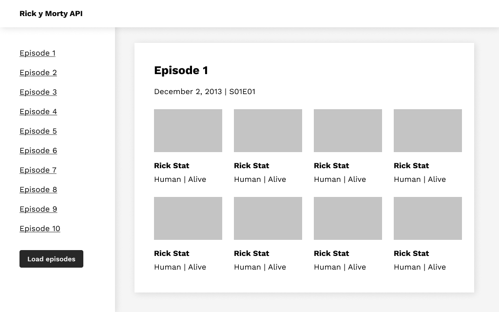
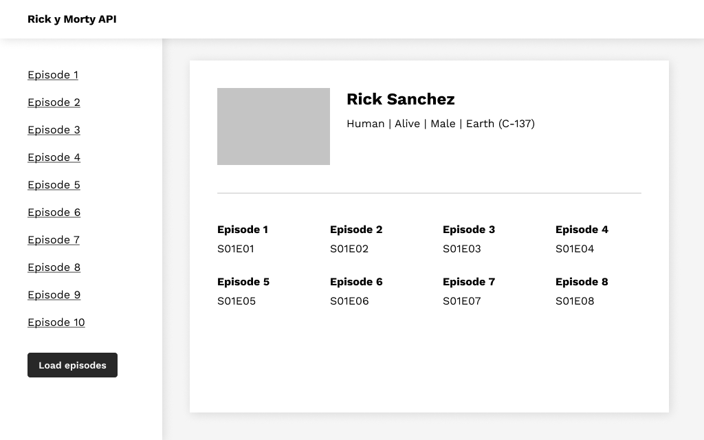
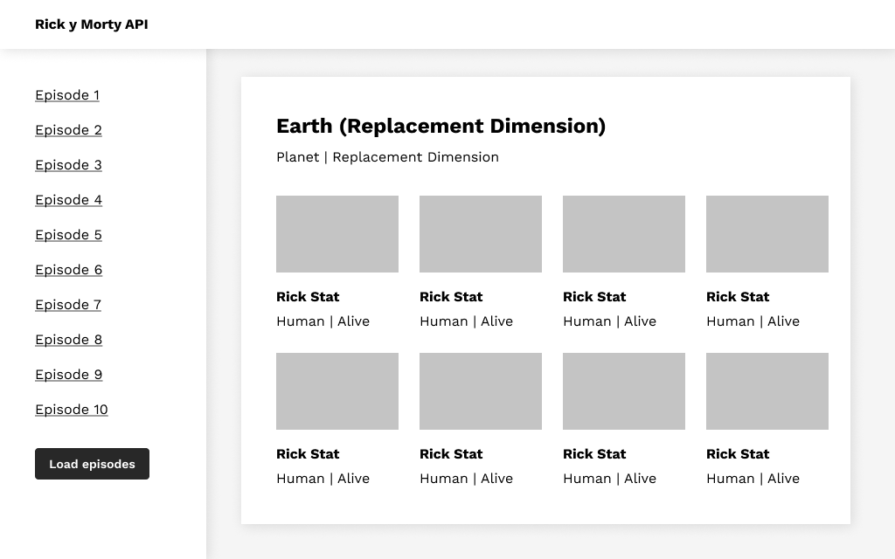

# Rick and Morty

In this project you must create your own website for the famous television series Rick and Morty.

#### What are the main objectives of this project?
- Obtain information from third-party API
- Improve your knowledge of HTML, CSS and JavaScript
- Learn more about how to integrate APIs and its interaction with the client
- Improve your skills in obtaining asynchronous information by using Fetch API
- Structure a web project in a clear and orderly manner

### General analysis
You must create a **website** capable of displaying all the information in the series (**episodes, characters, locations**) in an orderly manner so that you can **navigate through the episodes and characters**.

### 1.1. Rick and Morty API

The third party API that you must use to make the requests is [Rick and Morty](https://rickandmortyapi.com/documentation).

The main objective is to show the Rick and Morty episodes and navigate through the information it provides us.

The information that you should obtain from the API of each section is as follows:

#### 1.1.1. Episodes
In this section you will obtain information about the chapters of Rick and Morty:
- Name
- Air date
- Episode code 
    - Ex:  “S01E01”

#### 1.1.2. Characters
In this section you will obtain information about the characters of Rick and Morty:
- Name
- Status
- Species
- Gender
- Image

#### 1.1.3. Locations
In this section you will obtain information about the locations of Rick and Morty:
- Name
- Type
- Dimension
 
*Depending on which part you show the data in, you should get only part of the information shown above.*

### 1.2. Web structure
The initial information to show in this project will be the chapters, from which you must navigate within each one of them to show all the information related to them.

The page will consist of three main sections:
#### 1.2.1. Header
The header section should show at least the **Project title**
#### 1.2.2. Sidebar
The sidebar section should show at least the following information:
- List of the Rick & Morty episodes of the first API pagination
- Button that will load the next page of episodes below the previous one
- The user will be able to scroll in the sidebar to see the entire list of chapters
#### 1.2.3. Main container
The section of the main container will be the one that contains the detail of the elements.
### 1.3. Steps for development Part - 1
The steps to follow for the development of this project are detailed below:
#### 1.3.1. Step 1
To start you will have to create the web structure following the one mentioned above.

Once the web structure has been implemented, in the sidebar you should show an episode list, allowing the user the option to show more episodes through a button located after the last item in the list using the pagination of the API. You have to take into account that the user will be able to scroll in this list if it exceeds the height of the screen.
 
#### 1.3.2. Step 2
When the user clicks on an item in the episode list, you should display the information of the episode in question in the main container.

Information you must show for the selected episode:
- Name
- Air date
- Episode code 
    - Ex:  “S01E01”

#### 1.3.3. Step 3
Once the main information of the episode is shown in the main container, you should also show the following information for each of the characters that appear in that episode:
- Character name
- Character status
- Character specie
- Character image

#### Wireframe - Main view

### 1.4. Steps for development Part - 2
#### 1.4.1. Step 1
In this first step, if the user clicks on a character, you should show the following information about the character in the main container:
- Name
- Status
- Specie
- Gender
- Image
- Origin name
    - Ex: Earth (C-137)

#### 1.4.2. Step 2
In this step, you must show in the character view the list of episodes in which this character appears.

Episodes list:
- Episode name
- Episode code

If you click on an episode in the list, the information of that episode will be shown in the main container as you have previously implemented.
#### Wireframe - Character view

#### 1.4.3. Step 3
Once the previous step of the characters has been implemented, you must show a button that will load the detailed information of the origin location in the main container:
- Location name
- Location type
- Location dimension
- Residents list

If you select an item from this list, the detail of the selected character will be shown in the main container (note that the functionality of displaying the character information has already been applied previously)

#### Wireframe - Location view
